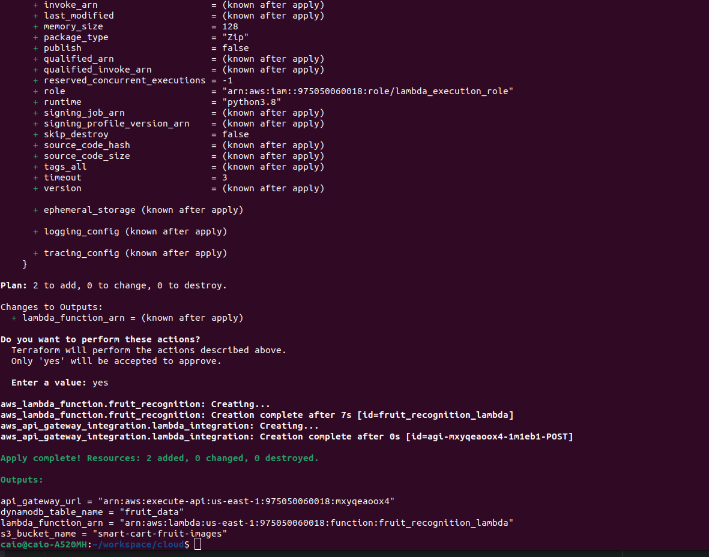
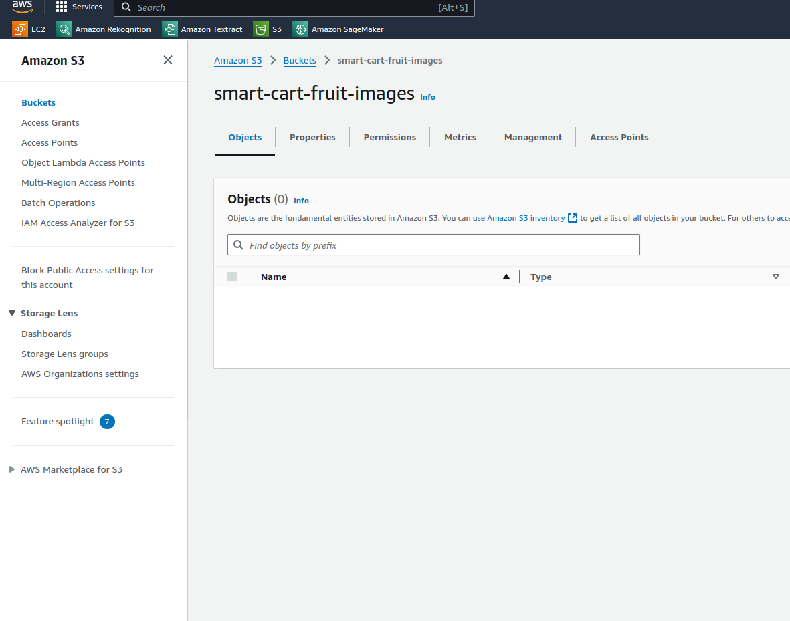
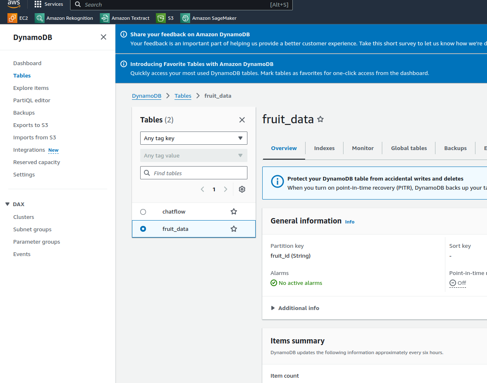
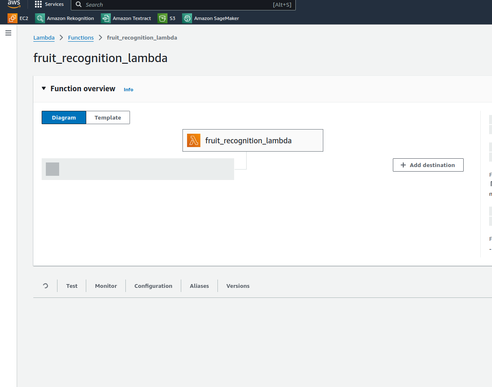
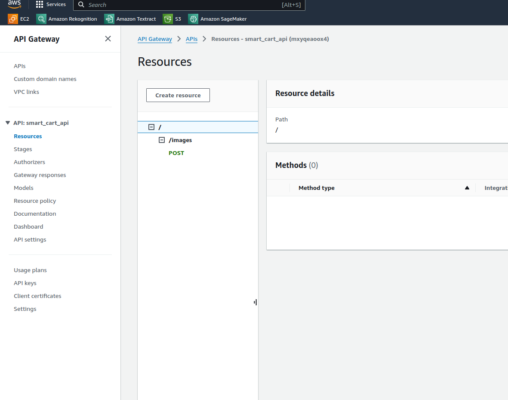

# Smart Cart Cloud Infrastructure - CS

#### Integrantes
- Bernardo Zakur Corrêa Santos **89116**
- Caio Oliveira Salchesttes **88227**
- Pedro Henrique Carlini de Oliveira Ribeiro **88783**
- Ricardo Sampaio Fogaça **86603**
- Gabriel Antonio Do Rego **88420**
- Sthefanie Aiko Yoshicava Dutra **87493**

Este repositório contém a configuração de infraestrutura como código (IaC) para o projeto **Smart Cart Cloud Infrastructure**, que utiliza a AWS para hospedar e processar funcionalidades associadas ao reconhecimento de frutas, visando auxiliar pessoas com deficiência visual em hortifrutis.

## Visão Geral

A arquitetura de nuvem foi construída para suportar os componentes principais do projeto usando o Terraform para provisionar recursos. A infraestrutura implementa:
- **AWS Lambda** para processamento de imagens usando algoritmos de visão computacional.
- **AWS API Gateway** para receber solicitações de dispositivos físicos (Carrinho Inteligente).
- **AWS DynamoDB** como banco de dados NoSQL para armazenar características das frutas.
- **AWS S3** para armazenamento de imagens capturadas.

## Pré-requisitos

- **Terraform** instalado em sua máquina. [Instruções de instalação](https://developer.hashicorp.com/terraform/tutorials/aws-get-started/install-cli).
- **AWS CLI** configurado com credenciais que possuem permissões para criar os recursos necessários.
- **VSCode** (opcional, recomendado para editar e gerenciar o código).
- Uma conta **AWS** com permissões para criar recursos IAM, Lambda, API Gateway, DynamoDB e S3.

## Estrutura do Projeto

```plaintext
.
├── main.tf           # Arquivo principal que chama outros módulos
├── variables.tf      # Variáveis reutilizáveis
├── outputs.tf        # Saídas dos recursos criados
├── lambda.tf         # Configurações da função AWS Lambda
├── apigateway.tf     # Configurações do API Gateway
├── dynamodb.tf       # Configurações da tabela DynamoDB
├── s3.tf             # Configurações do S3 Bucket
└── README.md         # Instruções e detalhes do projeto
```

## Evidências de criação

### Criação pelo console



### S3



### DynamoDB



### Lambda



### API Gateway

